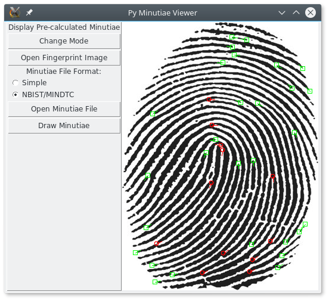

# Open Fingerprint Minutiae Viewer
Open Fingerprint Minutiae Viewer is a cross-platform, open-source, multi-format minutiae viewer. It is an alternative to the FpMV by the NBIST.

## How to Install

## Modes

There are two modes:

1. Extraction mode: This loads an image and uses MINDTCT to extract and display minutiae.
1. Pre-calculated mode: This does not calculate minutiae from the image, instead it draws minutiae from an external file over the image.

## How to Use

## Screenshots

The above screenshot shows the application in `pre-calculated mode`, drawing minutiae from an external file over a fingerprint image. 
