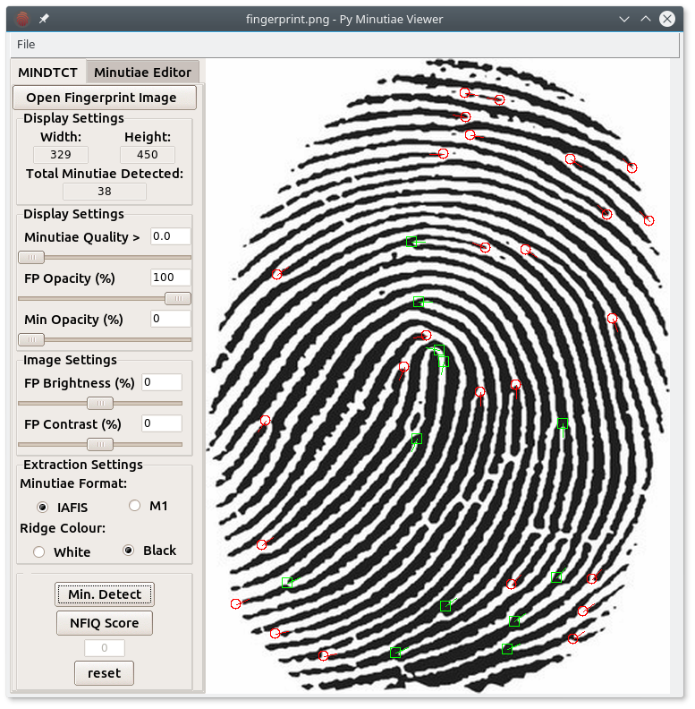
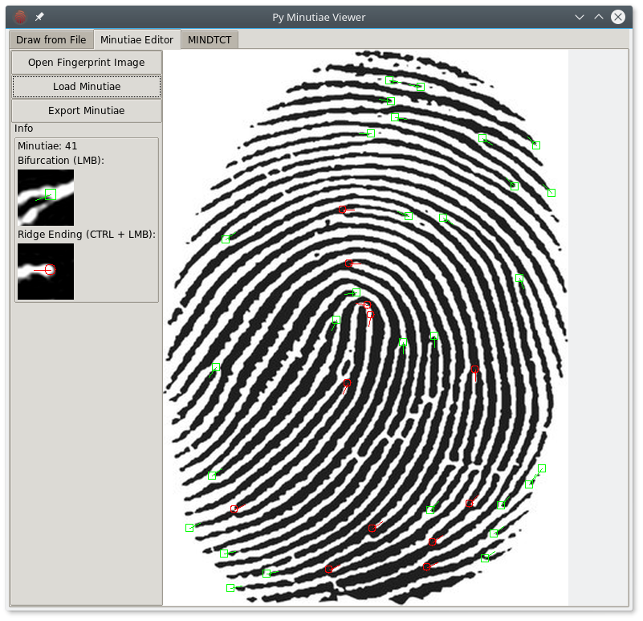

# Open Fingerprint Minutiae Viewer
Open Fingerprint Minutiae Viewer is a cross-platform, open-source, multi-format minutiae viewer, editor, and extractor. It is an alternative to the [FpMV](https://www.nist.gov/services-resources/software/fingerprint-minutiae-viewer-fpmv) by the NIST.

## How to Install

    git clone https://github.com/IgniparousTempest/py-minutiae-viewer
    cd py-minutiae-viewer
    sudo apt install python3-tk
    pip3 install -r requirements.txt
    python3 py-minutiae-viewer.py

## Modes

There are two modes:

1. Extraction mode: This loads an image and uses MINDTCT to extract and display minutiae.
2. Editor mode: This allows you to manually edit the detected minutiae or minutiae loaded from an external file.

## Screenshots

The above screenshot shows the application in `extraction mode`. Various settings can be set to extract the minutiae using `mindtct`.

The above screenshot shows the application in `editor mode`, the minutiae have been detected with an external minutiae detection algorithm. Now false positives are being removed and false negatives are being labeled.

## How to Use

## Acknowledgements

Please cite this tool in any paper that benefitted from its use. That would make me happy :) Here is the bibtex entry:

    @misc{Pitcher2017,
      author = {Pitcher, C.R.},
      title = {Open Fingerprint Minutiae Viewer},
      year = {2017},
      publisher = {GitHub},
      journal = {GitHub repository},
      howpublished = {\url{https://github.com/IgniparousTempest/py-minutiae-viewer}},
      commit = {bde52487d374ef102b348cc4521f71dcbefbd967}
    }
