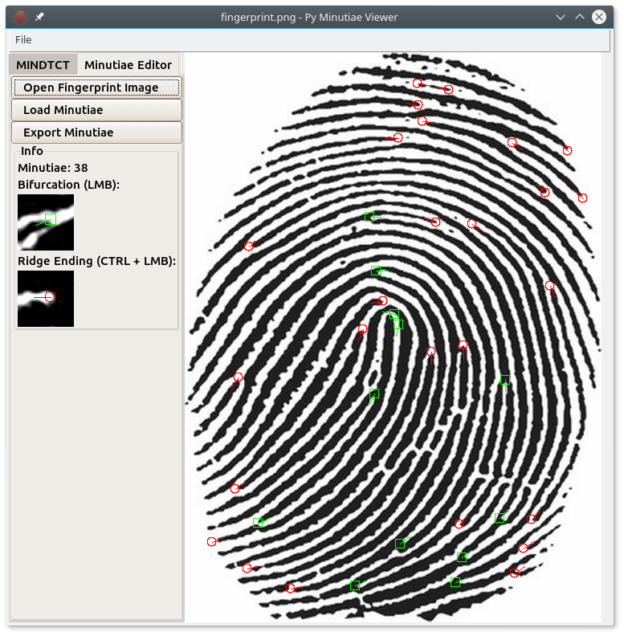

# Open Fingerprint Minutiae Viewer
Open Fingerprint Minutiae Viewer is a cross-platform, open-source, multi-format minutiae viewer, editor, and extractor. It is an alternative to the [FpMV](https://www.nist.gov/services-resources/software/fingerprint-minutiae-viewer-fpmv) by the NBIST.

## How to Install

## Modes

There are two modes:

1. Extraction mode: This loads an image and uses MINDTCT to extract and display minutiae.
2. Editor mode: This allows you to manually edit the detected minutiae or minutiae loaded from an external file.

## Screenshots

The above screenshot shows the application in `extraction mode`. Various settings can be set to extract the minutiae using `mindtct`.

The above screenshot shows the application in `editor mode`, the minutiae have been detected with an external minutiae detection algorithm. Now false positives are being removed and false negatives are being labeled.

## How to Use
